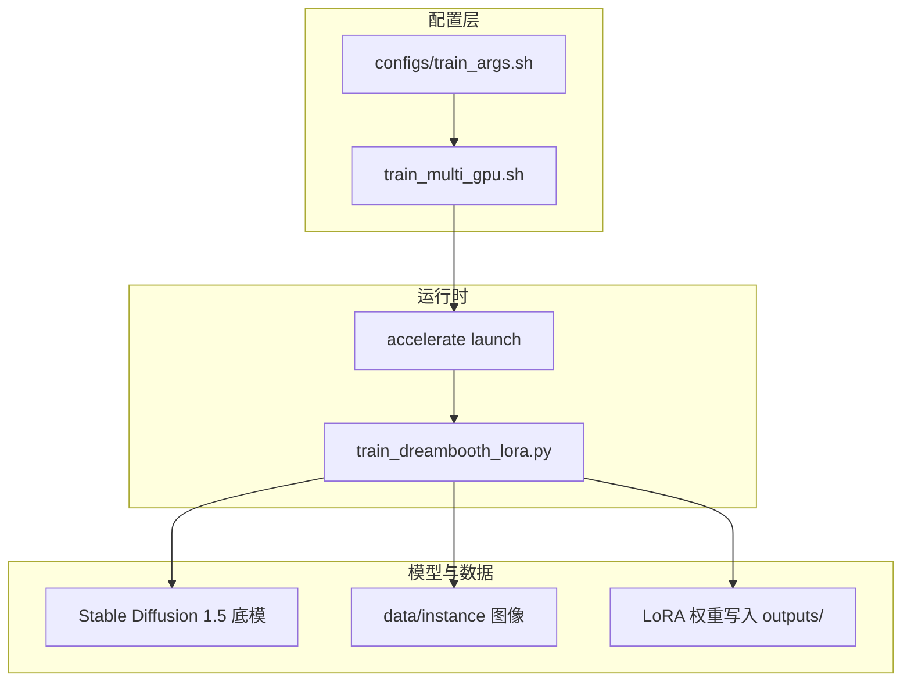
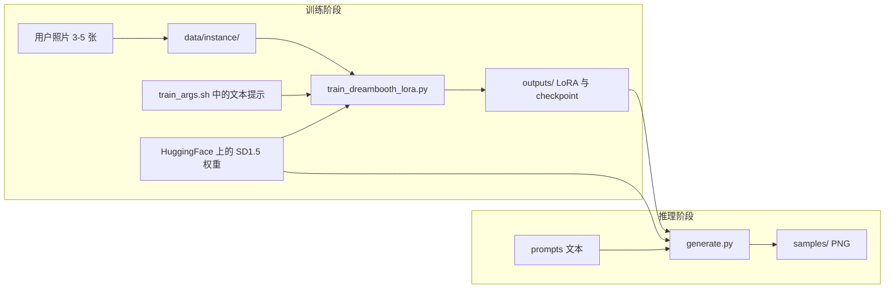
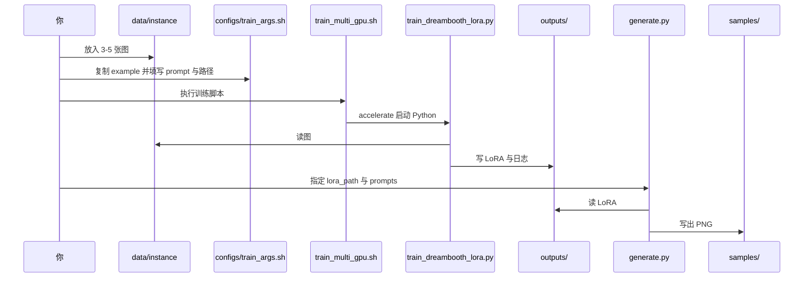

# 项目架构说明

本文档用通俗语言说明本仓库的**目录结构**、**训练流水线**以及**数据从输入到输出的流动过程**，便于你在报告或答辩中复述整体设计。

---

## 1. 文档目的与整体思路

本项目实现的是 **DreamBooth 风格的 LoRA 微调**：在少量（3–5 张）同一主体照片上训练，让 Stable Diffusion 学会「你说的那个具体东西」长什么样，同时又能在新场景、新风格下按文字描述生成图像。

工程上拆成三块：

1. **数据**：主体照片放在固定目录，由训练脚本读取。  
2. **训练**：用预训练 SD 1.5 + **LoRA 小适配器**（不整模型重训），可选 **双卡** 分布式加速。  
3. **推理**：把训练得到的 LoRA 权重挂回同一个底模，按 prompt 批量出图，结果放到 `samples/` 供报告使用。

---

## 2. 项目文件结构

下面按「根目录 → 子目录」说明每个部分**干什么、谁参与数据流**。

```text
Ass2/  （仓库根目录，名称可随你改名）
├── README.md                 # 环境与命令速查（英文为主）
├── requirements.txt          # Python 依赖版本（与 vendored 训练脚本对齐）
├── .gitignore                # 忽略数据、输出、密钥等不应进 Git 的内容
├── .env.example              # 环境变量模板（如 HF_TOKEN），复制为 .env 使用
│
├── configs/                  # 训练与推理的「人类可读」配置
│   ├── train_args.example.sh # 训练变量模板；复制为 train_args.sh 后修改
│   ├── train_args.sh         # （本地生成，默认不入库）真实训练参数
│   ├── dreambooth_lora.example.yaml  # 与 train_args 对应的 YAML 说明档
│   └── prompts.example.txt   # 批量推理时用的示例 prompt 列表
│
├── data/
│   ├── README.md             # 如何准备 3–5 张训练图
│   └── instance/             # 放置训练图片（文件名被 gitignore）
│
├── outputs/                  # 训练产物：checkpoint、LoRA、TensorBoard 等（内容默认不入库）
├── samples/                  # 推理精选图：适合贴进课程 PDF 报告
├── report/                   # 报告源稿与本架构文档
│   └── 项目架构说明.md       # （本文件）
│
└── scripts/
    ├── train_multi_gpu.sh    # 封装 accelerate launch，读 configs/train_args.sh
    ├── train_dreambooth_lora.py  # 上游 diffusers 提供的 LoRA DreamBooth 训练脚本（v0.31.0）
    ├── generate.py           # 加载 LoRA + 底模，按 prompt 出图
    ├── VENDORED.md           # 训练脚本来源与版本说明
    └── accelerate_config_hint.md  # 首次配置 accelerate 的提示
```

### 2.1 哪些会进 Git，哪些不会？

| 类型 | 典型路径 | 说明 |
|------|-----------|------|
| 应提交 | `scripts/`、`configs/*.example.*`、`README.md`、`requirements.txt`、`report/*.md` | 可复现实验的代码与说明 |
| 通常不提交 | `data/instance/*`、`.env`、`outputs/*`、`configs/train_args.sh`（若含个人路径） | 隐私、大文件、本机路径 |
| 可选提交 | `samples/` 里少量展示图 | 方便展示效果；注意版权与隐私 |

`.gitignore` 已按上述思路配置；提交前可用 `git status` 确认没有误加照片或权重。

---

## 3. 训练架构与「管道」指什么

### 3.1 三个软件层次



- **`train_args.sh`**：只负责「填参数」——学谁（instance prompt）、数据在哪、训多少步、学习率、输出目录等。  
- **`train_multi_gpu.sh`**：不改算法，只负责用 **Accelerate** 以正确方式拉起多进程，并把路径转成**绝对路径**传给 Python，避免在子目录执行时找不到数据。  
- **`accelerate launch`**：PyTorch 训练的入口；`--num_processes` 为 1 时单卡训练，大于 1 时用多张 GPU 各跑一份模型副本，做 **DDP（分布式数据并行）**。  
- **`train_dreambooth_lora.py`**：真正实现 **读图 → 编码文本 → 扩散损失 → 只更新 LoRA 参数** 的逻辑（来自 Hugging Face diffusers 示例）。

### 3.2 双卡训练时在做什么（直观理解）

可以把它想成：**同一份作业，两个人各拿一张显卡同时做**，每隔几步把两人算出的梯度「对一下齐」再更新模型，这样每一步能处理的有效 batch 更大、训练更快。  
LoRA 只增加很少的可训练参数，所以 12GB 级显存也能训 SD 1.5 的适配器。

> 若只有一张卡，把环境变量 `NUM_PROCESSES=1` 即可，逻辑不变，只是不用多进程。

### 3.3 DreamBooth + LoRA 在学什么（概念）

- **Instance prompt**（如 `a photo of sks dog`）里的 **稀有 token（如 sks）** 被当成「这个主体的名字」。  
- 模型在训练图上反复看到这个名字和对应像素，就学会把 **sks** 和 **你的那只狗的外观**绑在一起。  
- **LoRA** 不替换整个 U-Net，只在部分层上加「小补丁」，所以文件小、训练快，适合课程作业。

可选的 **prior preservation**（本仓库默认关闭）会在训练时额外约束「别只记得你的主体而忘了一般狗长啥样」——需要类图或在线生成类图，配置更复杂，作业可先不用。

---

## 4. 数据流：从照片到报告用图

### 4.1 总览（训练 + 推理）



### 4.2 训练阶段数据流（细化）

1. **图像**  
   - 磁盘上的 JPG/PNG → 训练脚本用 `PIL` 读入 → 按 `resolution` 缩放/裁剪 → 送入 **VAE 编码到潜空间**（扩散模型在潜变量上算损失，而不是直接在高分辨率像素上算）。  

2. **文本**  
   - `instance_prompt` 字符串 → **CLIP 文本编码器** → 与噪声时间步一起输入 **U-Net**。  
   - DreamBooth 要求同一批图用**同一条**带 identifier 的 prompt（或脚本支持的变体），这样「词—外观」才对齐。  

3. **梯度与保存**  
   - 损失反向传播时，**只更新 LoRA 矩阵**（以及可选 text encoder LoRA，本默认脚本以 U-Net LoRA 为主）。  
   - 周期性写入 `outputs/<你的 OUTPUT_DIR>/`，最终常见产物包括 **`pytorch_lora_weights.safetensors`** 等。  
   - TensorBoard 日志写在输出目录下，便于看 loss 曲线。

### 4.3 推理阶段数据流

1. **`generate.py`** 从 Hugging Face 再加载一次 **同一 `pretrained_model_name_or_path`**（须与训练一致）。  
2. 用 **`pipe.load_lora_weights(lora_path)`** 把训练目录里的 LoRA 叠加上去。  
3. 每个 `(prompt, seed)`：随机噪声 → 多步去噪 → **像素图** → 写入 `samples/`。  

这样，**数据流在推理阶段不再经过你的训练图**，只经过「已固化为权重的知识」和「你写的英文 prompt」。

---

## 5. 端到端操作顺序（与数据流对应）



---

## 6. 小结表

| 问题 | 答案（一句话） |
|------|----------------|
| 训练读什么？ | `data/instance/` 里的图片 + `train_args.sh` 里的 `instance_prompt` 等。 |
| 训练写出什么？ | 主要在 `outputs/` 下的 LoRA 与中间 checkpoint。 |
| 推理读什么？ | 底模（网上下载）+ `outputs/` 里训练好的 LoRA + 你的 prompt 文本。 |
| 推理写出什么？ | `samples/`（或你指定的目录）里的 PNG。 |
| 双卡起什么作用？ | 用 Accelerate 做多 GPU 并行，加快训练，不改变算法本质。 |

---

## 7. 延伸阅读

- 仓库根目录 [`README.md`](../README.md)：安装与命令。  
- [`scripts/VENDORED.md`](../scripts/VENDORED.md)：训练脚本版本与上游链接。  
- [`scripts/accelerate_config_hint.md`](../scripts/accelerate_config_hint.md)：首次 `accelerate config` 的选项建议。

若你之后在报告里写「方法」章节，可直接引用**第 3、4 节**的流程图与表格，并补充你自己的 **instance prompt、步数、学习率、随机种子** 等可复现信息。
